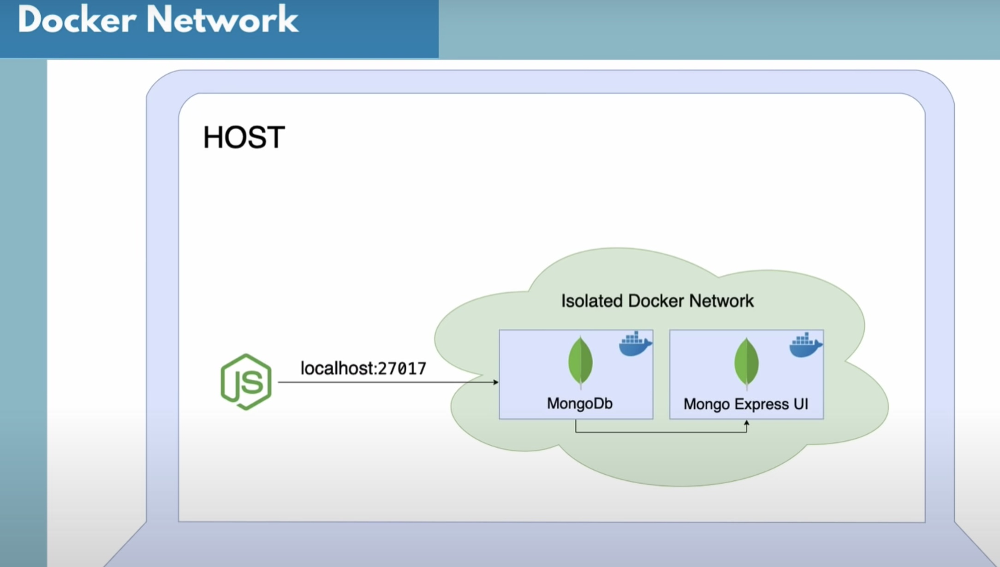

# Docker

A developer builds an application and sends it to the tester. But, the environments of development and testing systems are different; thus, the code does not work. There are two solutions to this: Docker and Virtual Machines, but Docker is far better in terms of performance, scaling, and efficiency.   

Docker is a platform that has eased application development for both developers and system managers. Dockers have been used widely in many DevOps toolchains. Docker provides flexibility for the operational team thereby reducing the risk overhead. Dockers platform provides numerous features include application isolation, portable, security management, Ease of software delivery, scalability, etc.    

Docker is a platform that enables creating, deploying, and running applications with the help of containers. A Container is a unit of software that packages the code and all its dependencies together such that the application becomes runnable irrespective of the environment.   

Container isolates the application and its dependencies into a self-contained unit that can run anywhere. Container removes the need for physical hardware allowing for more efficient use of computing resources. Containers provides operating-system-level virtualization. Moreover, developers can collaborate faster without worrying about which software dependency they need to install.    

A container is a runnable instance of an image. An image is a read-only template with instructions for creating a Docker container. You can create, start, stop, move, or delete a container using the Docker API or CLI. One can connect a single container to one or more networks and can also attach storage to it. A new image can also be created based on the current state of the container. Containers can be shared thereby ensuring that everyone who communicates with it will get the same container and that works in the same way.    

## Basic Docker Commands

- `docker --version [OPTIONS]`
    - This command is used to get the current version of the docker.
- `docker images`
    - Prints all the current images installed locally.
- `docker pull [OPTIONS] [IMAGE_NAME]`
    - Pull an image or a repository from a registry, To download an image or set of images (i.e. A Repository) , Once can use docker pull command.
- `docker run [OPTIONS] [IMAGE_NAME]`
    - This command is used to create a container from an image 
- `docker ps`
    - This command is used to list all the containers plotting their IDs, Ports etc
    - `docker ps -all` to print all the past containers
- `docker stop [OPTIONS] [Container_ID]`
    - This command is used to stop one or more running containers. 
- `docker restart [OPTIONS] [Container_ID]`
    - This command is used to restart one or more containers. 
- `docker kill [OPTIONS] [Container_Name]`
    - This command is used to kill one or more containers. 
- `docker logs [Container_ID]`
    - Commands that helps debugging
- `docker exec -it Container_ID COMMAND`
    - This command is used to run a command in a running container, example: `docker exec -it Container_ID /bin/bash` we get the bash as vm as a root user
- `docker commit` 
    - This command is used to create a new image from the container image. 
- `docker push`
    - This command is used to push an image or repository to a registry. 
- `docker network ls`
    - Available networks, used for intercommunication between containers
    - How to create a docker network:
        - `docker network create NETWORK_NAME`

[OPTIONS] 
`-d`
- detached mode : run the container without the terminal: `docker run -d [IMAGE_NAME]`

`-a`
- Print container that are running and not running 

`- p[Host Port Number]:[Binding Port Number]`
- Bind port of your host (port of the host <-- port which you exernaly send requests) to the container (port of tha you are binding this). **Port**: specifies on which port the container is listening to the incomming request. example: `docker run -p6000:6379 [IMAGE_NAME]`

## Docker & Mongo
- Install mongo
0. `docker pull mongo` 

- Run mongo server:
1. `docker run -p 27017:27017 -d mongo`  

- Run mongo to bash shell/command prompt and execute classic mongo commands:
1. `docker run -p 27017:27017 -d mongo`  
2. get the mongo_Container_ID from the `docker ps` command
3. `docker exec -it mongo_Container_ID bash`
4. you will get into the shell
5. `mongosh` 
6. you may execute mongoDB commands for example: `show dbs` 

- Run mongo with docker express in an isolated Docker Network 

1. Install mongo express: `docker pull mongo-express`, which provides a UI access to mongo.
2. Create a network in which mongo and mongo express will intercommunicate
    - `docker network create mongo-network`
3. Start mongo with particular parameters:
    `docker run -d \
    -p 27017:27017 \
    -e MONGO_INITDB_ROOT_USERNAME=admin \
    -e MONGO_INITDB_ROOT_PASSWORD=password \
    --name mongodb \
    --net mongo-network \
    mongo`
4. Start mongo express with particular parameters relative to mongo:
    `docker run -d \
    -p 8081:8081 \
    -e ME_CONFIG_MONGODB_ADMINUSERNAME=admin \
    -e ME_CONFIG_MONGODB_ADMINPASSWORD=password \
    -e ME_CONFIG_MONGODB_SERVER=mongodb \
    --name mongo-express \
    --net mongo-network \
    mongo-express`
    - where is defined above ME_CONFIG_MONGODB_SERVER

## Docker & MySQL
- Install mysql
0. `docker pull mysql` 

- Run mongo server:
1. `docker run -d \
    -p 3306:3306 \
    -e MYSQL_ROOT_PASSWORD=myrootpass22 \
    --name mysql \
    mysql`

## Docker Compose
Compose is a tool for defining and running multi-container Docker applications with just one file. With Compose, you use a **YAML** file to configure your application’s services. Then, with a single command, you create and start all the services from your configuration. For example for the mongodb we executed above we create a file name `mongo.yaml` and include the following translation:

`
version: '3'
services:
    mongodb:
        image: mongo
        ports:
            - 27017:27017
        environment:
            - MONGO_INITDB_ROOT_USERNAME=admin
            - MONGO_INITDB_ROOT_PASSWORD=password
        mongo-express:
            image: mongo-express
        ports:
            - 8080:8081 
        environment:
            - ME+CONFIG MONGODB_ADMINUSERNAME=admin
            - ME_CONFIG_MONGODB_ADMINPASSWORD=password
            - ME_CONFIG_MONGODB_SERVER=mongodb
`
Execute the command (no containers should be running): `docker-compose -f mongo.yaml up` and 

## Dockerfile
Docker can **build images** automatically by reading the instructions from a Dockerfile. A Dockerfile is a text document that contains all the commands a user could call on the command line to assemble an image. Dockerfile is the blueprint of your project.
- Create a dockerfile

- Execute the docker file:
`docker build -t MY_APP_NAME:VERSION_NUMBER`

# References
- Docker basic commands: https://www.knowledgehut.com/blog/devops/basic-docker-commands#basic-docker-commands
- Docker all in one (very good tutorial): https://www.youtube.com/watch?v=3c-iBn73dDE
- MongoDB shell + Docker: https://www.youtube.com/watch?v=Xqbj2o3wckI
- MySQL Docker commands: https://hub.docker.com/_/mysql 
- MySQL + Docker: https://www.youtube.com/watch?v=kphq2TsVRIs

