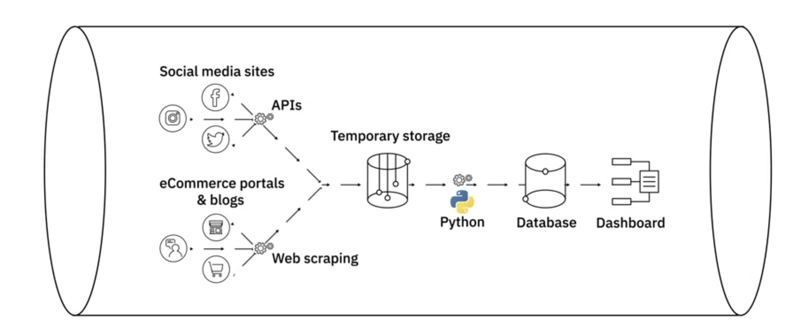
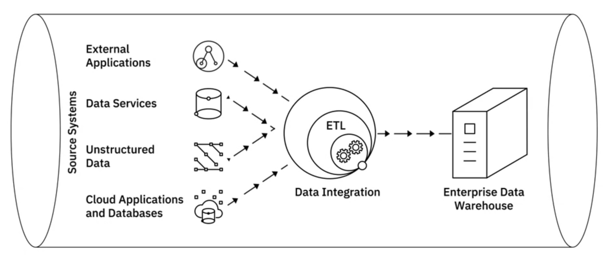
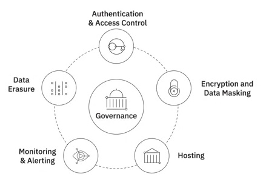
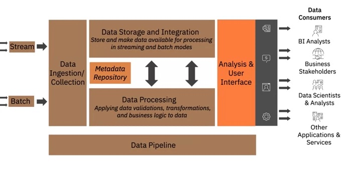
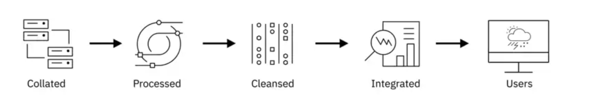

# Data-Engineering

The field of Data Engineering concerns itself with the mechanics for the flow and access of data. Its goal is to make quality data available for fact-finding and data-driven decision making.

**Data Engineers**:
- Designing, Building, Maintaining data infrastructures and platforms
- Develop and optimize data systems
- Make data available for analysis

**Data Analysts**:
- Analyze data in data systems to report and derive insights

**Data Scientists**:
- Perform deeper analysis on data
- Develop predictive models to solve more complex data problems

The **field of Data Engineering involves**:
- Collecting source data (Extracting, integrating, and organizing data from disparate sources)
    - Data acquisition from multiple sources
    - Data architecture for storing source data
- Processing data (Cleaning, transforming, and preparing data to make it usable)
    - Distributed systems for processing data
    - Pipelines for extracting, transforming, and loading data
    - Solutions for safeguarding quality, privacy, and security of data
    - Performance optimization
    - Adherence to compliance guidelines
- Storing data for reliability and easy availability of data
    - Data stores for storage of processed data
    - Scalable systems
    - Ensuring data privacy, security, compliance, monitoring, backup, and recovery
- Making data available to users securely
    - APIs, services, and programs for retrieving data for end-users
    - User access through interfaces and dashboards
    - Checks and balances to ensure data security

# Languages needed for Data Engineers

- Query languages:
    - SQL for mostly relational databases we use mostly for: 
    - NoSQL or SQL-like query languages for NoSQL databases
        
- Programming languages
    - Python, R, Java
        
- Shell and Scripting languages
    - Unix/Linux Shell and PowerShell
        
- Big Data Processing Tools
    - Hadoop (for Big Data)
    - HIVE
    - Spark Apache
       
# Data

### **Data Forms**:
- Structured
    - Data that follows a rigid format and can be organized into rows and columns.
        - SQL Databases
        - Online Transaction Processing
        - Spreadsheets
        - Online forms
        - Sensors GPS and RFID
        - Network and Web server logs
- Semi-structured
    - Mix of data that has consistent characteristics and data that does not conform to a rigid structure (Row, columns).
    - **XML and JSON** Allow users to Define Tags Attributes and to store Semi-Structured data
        - E-mails
        - XML and other markup languages
        - Binary executables
        - TCP/IP packets
        - Zipped files
        - Integration of data
- Unstructured
    - Data that is complex and mostly qualitative information that cannot be structured into rows and columns.
    - Does not have an easily identifiable structure
    - Cannot be organized in a mainstream relational database in the form of rows and columns
    - Does not follow any particular format, sequence, semantics, or rules
       - such as Files and Docs
       - Manual Analysis
       - NoSQL
       - Analysis tools

### **Standard File Formats**:
1. Delimited text file formats, or .CSV 
    - Delimiter - A sequence of one or more characters for specifying the boundary between independent entities or values (Comma, Tab, Colon, Vertical Bar, Space).
2. Microsoft Excel Open .XML Spreadsheet, or .XLSX
    - Open file format, accessible to most other applications
    - Can use and save all functions available in excel
    - Is a secure file format as it cannot save malicious code
3. Extensible Markup Language, or XML
    - Extensible Markup Language, or XML, is a markup language with set rules for encoding data.
        - Readable by both humans and machines
        - Self-descriptive language
        - Similar to .HTML in some respects
        - Does not use predefined tags like .HTML does
        - Platform independent
        - Programming language independent
        - Makes it simpler to share data between systems
4. Portable Document Format, or .PDF
5. JavaScript Object Notation, or .JSON
    - JavaScript Object Notation, or JSON, is a text-based open standard designed for transmitting structured data over the web.
        - Language-independent data format
        - Can be read in any programming language
        - Easy to use
        - Compatible with a wide range of browsers
        - Considered as one of the best tools for sharing data

# DataBases

- **Data Repository** is a general term used to refer to data that has been collected, organized, and isolated. Data repositories help to isolate data and make reporting and analytics more efficient and credible while also serving as a data archive.
- **DataBase**: Collection of data for input, storage, search, retrieval, and modification of data.
- **DataBase Management System** Set of programs for creating and maintaining the database, and storing, modifying, and extracting information from the database.
- **Factors governing choice of database include**: Data type; Data structure; Querying mechanisms; Latency requirements; Transaction speeds; Intended use of data

## **Types of Data Repositores:**

- Relational DataBase Management System (RDBMS)
    - Languages of RDBMS: SQL Server, MySQL, IBM DB2, Oracle Database, PostgreSQL
    - Data is organized into tables format with rows (Records) and columns (Attributes).
    - Well-defined structure and schema for Structured Data.
    - Optimized for data operations and querying
    - Use SQL as the standard querying language
    - Insert, update, and delete records in a database Create new databases, tables, and views Write stored procedures
    - Cloud relational databases include Amazon Relational Database Service (RDS), Google Cloud SQL, IBM DB2 on Cloud, Oracle Cloud, and SQL Azure. 
    - Minimize data redundancy by allowing relationships to be defined between tables
    - Offer export and import options that provide ease of backup and disaster recovery
    - Are ACID compliant, ensuring accuracy and reliability in database transactions
    - Does not work well with semi-structured and unstructured data
    - Migration between two DBMS's is possible only when the source and destination tables have identical schemas and data types

- No-Relational DataBase Management System Database (NoSQL):
    - Languages of non-RDBMS: Redis, MongoDB, Cassandra, Ne04J, HBase
    - Emerged in response to the volume, diversity, and speed at which data is being generated today
    - Built for speed, flexibility, and scale
    - Data can be stored in a schema-less form widely used for processing big data
    - Do not use a traditional row/column/table database design with fixed schemas
    - Types of NoAQL:
        - Key-value store
            - Data in a key-value database is stored as a collection of key-value pairs.
            - A key represents an attribute of the data and is a unique identifier.
            - Both keys and values can be anything from simple integers or strings to complex JSON documents.
            - Great for storing user session data, user preferences, real-time recommendations, targeted advertising, in-memory data caching.
            - Not a great fit if you want to: Query data on specific data value; Need relationships between data values; Need multiple unique keys
            - i.e. Redis, Memcached, and DynamoDB 
        - Document Based
            - Document databases store each record and its associated data within a single document.
            - They enable flexible indexing, powerful ad hoc queries, and analytics over collections of documents.
            - Preferred for eCommerce platforms, medical records storage, CRM platforms, and analvtics platforms.
            - Not a great fit if you want to: Run complex search queries; Perform multi-operation transactions
            - i.e. MongoDB, DocumentDB, CouchDB, and Cloudant are some of the popular document-based databases
        - Column Based
            - Data is stored in cells grouped as columns of data instead of rows.
            - A logical grouping of columns is referred to as a column family.
            - All cells corresponding to a column are saved as a continuous disk entry, making access and search easier and faster.
            - Great for systems that require heavy write requests, storing time-series data, weather data, and IoT data.
            - Not a great fit if you want to: Run complex queries; Change querying patterns frequently
            - The most popular column databases are Cassandra and HBase.
        - Graph Based
            - Graph-based databases use a graphical model to represent and store data.
            - Useful for visualizing, analyzing, and finding connections between different pieces of data.
            - Graph databases are great for social networks, real-time product recommendations, network diagrams, fraud detection, and access management
            - Not a great fit if you want to: Process high volumes of transactions
            - Neo4J and CosmosDB are some of the more popular graph databases.

- Data Warehouses:
    - i.e. Oracle Exadata, IBM, Db2 Warehouse on Cloud, IBM Netezza Performance, Server, Amazon RedShift    
    - serve as the single source of truth—storing current and historical data that has been cleansed, conformed, and categorized.
    - Works as a central repository that merges information coming from disparate sources and consolidates it through the extract, transform, and load process, also known as the ETL process, into one comprehensive database for analytics and business intelligence. 
    - When data gets loaded into the data warehouse, it is already modeled and structured for a specific purpose, meaning it's analysis-ready
    - Modern WareHouses have a three-tier architecture: 
        - The bottom tier of the architecture includes the database servers, which could be relational, non-relational, or both, that extract data from different sources. 
        - The middle tier of the architecture consists of the OLAP Server, a category of software that allows users to process and analyze information coming from multiple database servers. 
        - And the topmost tier of the architecture includes the client front-end layer. 
    - Some of the popularly used data warehouses include Teradata Enterprise Data Warehouse platform, Oracle Exadata, IBM Db2 Warehouse on Cloud, IBM Netezza Performance Server, Amazon RedShift, BigQuery by Google Cloudera's Enterprise Data Hub, and Snowflake Cloud Data Warehouse.

- Data Mart:
    - A data mart is a sub-section of the data warehouse, built specifically for a particular business function, purpose, or community of users. 
     - Three basic types of data marts: dependent, independent, and hybrid data marts.
        - Dependent data marts are a sub-section of an enterprise data warehouse. Data mart offers analytical capabilities for a restricted area of the data warehouse, it also provides isolated security and isolated performance. Dependent data marts, pull data from an enterprise data warehouse, where data has already been cleaned and transformed. 
        - Independent data marts are created from sources other than an enterprise data warehouse, such as internal operational systems or external data. Independent data marts need to carry out the transformation process on the source data since it is coming directly from operational systems and external sources.
        - Hybrid data marts combine inputs from data warehouses, operational systems, and external systems. 
    
- Data Lakes:
    - a data repository that can store large amounts of structured, semi-structured, and unstructured data in their native format. While a data warehouse stores data that has been cleaned, processed, and transformed for a specific need, you do not need to define the structure and schema of data before loading into the data lake.
    - Store large amounts of structured, semi-structured, and unstructured data in their native format
    - Data can be loaded without defining the structure and schema of data
    - Exist as a repository of raw data straight from the source, to be transformed based on the use case
    - Data is classified, protected, and governed
    - A reference architecture that combines multiple technologies
    - Can be deployed using:
        > Cloud Object Storage, such as Amazon S3
        > Large-scale distributed systems such as Apache Hadoop
        > Relational Database Management Systems, as well as NoSOL data repositories
    - Ability to store all types of data (unstructured, semi-structured and structured data)
    - Agility to scale based on storage capacity (growing from terabytes to petabytes)
    - Saving time in defining structures, schemas, and transformations (data is imported in its original format)
    - Ability to repurpose data in several different ways and wide-ranging use cases

## **Types of Data Transformation and Storage:**

- ETL Tools Methodologies:
    - i.e. IBM Infosphere, AWS Glue (Amazon),improvado
    - tools and processes that work to move data from source to destination systems, such as: ETL, or the Extract, Transform, and Load Process ELT, or the Extract, Load, and Transform Process
    - ETL: Extract, Transform, and Load process. ETL is how raw data is converted into analysis-ready data. Automated process which includes:
        - Extracting (Gathering raw data) information needed for reporting and analysis. 
            - Batch processing-large chunks of data moved from source to destination at scheduled intervals (tools: Sitch and Blendo)
            - Stream processing-data pulled in real-time from source, transformed in transit, and loaded into data repository (tools: Apachi Samza Storm and Kafka)
        - Transforming, Cleaning, and standardizing  data into usable format
            - Standardizing date formats and units of measurement
            - Removing duplicate data
            - Filtering out data that is not required
            - Enriching data
            - Establishing key relationships across tables
            - Applying business rules and data validations
        - Loading data into a data repository. Loading is the transportation of processed data in to a data repository. It can be:
            - Initial loading--populating all of the data in the repository
            - Incremental loading-applying updates and modifications periodically
            - Full refresh-erasing a data table and reloading fresh data
            - Load Verification includes checks for: Missing or null values. Server performance, Load failures
    - At a very high-level, the ETL process helps you to extract data from different data sources, transform the data into a clean and usable state, and load the data into the enterprise’s data repository. 
    - In the **ELT** process, extracted data is first loaded into the target system, and transformations are applied in the target system. The destination system for an ELT pipeline is most likely a data lake, though it can also be a data warehouse.
        - Helps process large sets of unstructured and non-relational data
        - Is ideal for Data Lakes
        - Shortens the cycle between extraction and delivery
        - Allows you to ingest volumes of raw data as immediately as the data becomes available
        - Affords greater flexibility to analysts and data scientists for exploratory data analvtics
        - Transforms only that data which is required for a particular analysis so it can be leveraged for multiple use cases
        - Is more suited to work with Big Data

- Data Pipelines
    - i.e. Apache Beam; AirFlow; DataFLow
    - Encompasses the entire journey of moving data from one system to another, including the ETL process
    - Can be used for both batch and streaming data
    - Supports both long-running batch queries and smaller interactive queries
    - Typically loads data into a data lake but can also load data into a variety of target destinations-including other applications and visualization tools
    - Extract, Transform and Load Process
    - Extract, Load, and Transform Process
    

- Data Integration includes:
    - Accessing, queueing, or extracting data from operational systems
    - Transforming and merging extracted data either logically or physically
    - Data quality and governance
    - Delivering data through an integrated approach for analytics purposes
How does a data integration platform relate to ETL and data pipelines? While data integration combines disparate data into a unified view of the data, a data pipeline covers the entire data movement journey from source to destination systems. In that sense, you use a data pipeline to perform data integration, while ETL is a process within data integration. 

- Big Data Processing Tools
    - hadoop, hive, spark apache
    - HDFS 
    - The Big Data processing technologies provide ways to work with large sets of structured, semi-structured, and unstructured data so that value can be derived from big data.

- Governance & Compliance 

- Data Wrangling
    - Data Exploration
    - Transformation
    - Validation
    - Making data available for credible and meaningful analysis

Data Ingestion or Collection Layer:

Transactional Systems used for capturing high-volume transactions, need to be designed for high-speed read, write, and update operations.

Analytical Systems need complex queries to be applied to large amounts of historical data aggregated from transactional systems. They need faster response times to complex queries.

Schema design, indexing, and partitioning strategies have a big role to play in performance of systems based on how data is getting used.

Normalization is another important consideration at the design stage.
- Optimal use of storage space
- Makes database maintenance easier
- Provides faster access to data

Design considerations from the perspective of storage:
Performance, Availability, Integrity, and Recoverability of Data
These are Performance, Availability, Integrity, and Recoverability of Data. Performance parameters include throughput and latency. That is, the rate at which information can be read from and written to the storage and the time it takes to access a specific location in storage. Availability - Your storage solution must enable you to access your data when you need it, without exception. There should be no downtime. Integrity - Your data must be safe from corruption, loss, and outside attack. And Recoverability - Your storage solution should ensure that you can recover your data in the event of failures and natural disasters. 

A secure data strategy is a layered approach. It includes access control, multizone encryption, data management, and monitoring systems. Regulations such as GDPR, CCPA, and HIPAA restrict the ownership, use, and management of personal and sensitive data. Data needs to be made available through controlled data flow and data management by using multiple data protection techniques. This is an important part of a data store design. Strategies for data privacy, security, and governance regulations need to be a of a data store's design from the start.

## **Considerations for choice of Data Repository:**
- A number of different factor influence the selection of the right data repository
- Type of data - structured, semi-structured, or unstructured
- Schema of the data Performance requirements
- Whether you're working with data at rest or streaming data (data in motion)
- Data encryption needs
- Volume of data and whether you need a Big Data system  
- Storage requirements
- Frequency of data access
    - Frequent updates
    - Keep in vault for long time
- Standards set by your organization on the databases and database repositories that can be used
- Capacity the data repository is required to handle
- Type of access:
    - At short intervals
    - Run long-running queries
- Purpose of data repository:
    - Transactional
    - Analytical
    - Archival
    - Data warehousing
- Compatibility of the data repository with the existing ecosystem of programming languages, tools, and processes
- Security features of the data repository
- Scalability from a long-term perspective

- APIs
    - Text, XML, HTML, Jason
- Web Services
- Data Streams
    - Popular data streams tools: **(Kafka, Apache Spark, Apache Storm)**.
    - Aggregating streams of data flowing from instruments, IT devices and applications, GPS data from cars, computer programs, websites, and social media posts.
        - Social media feeds for sentiment analysis.
        - Sensor data feeds for monitoring industrial or farming machinery.
        - Web click feeds for monitoring web performance and improving design.
        - Real-time flight events for rebooking and rescheduling.
    - RSS (or Really Simple Syndication) feeds Capturing updated data from online forums and news sites where data is refreshed on an ongoing basis.
- Social Platforms
- Sensor Devices
- Web Scraping
    - Popular web scraping tools: **(BeautifulSoup, Scrapy, Pandas, Selenium)** 
    - Extract relevant data from unstructured sources
    - Also known as Screen scraping, Web harvesting, and Web data extraction
    - Downloads specific data based on defined parameters
    - Can extract text, contact information, images, videos, product items, and more...

**Data Repositories**:
- Transactional Or Online Transaction Processing (OLTP) System
    - Designed to store high volume day-to-day operational data
    - Typically relational, but can also be non-relational

- Analytical or Online Analytical Processing (OLAP) Systems
    - Optimized for conducting complex data analytics
    - Include relational and non-relational databases, data warehouses, data marts, data lakes, and big data stores

## Data Integration

# Refernce
- https://www.coursera.org/specializations/data-engineering-foundations

#In have to include them soon

A layer represents functional components that perform a specific set of tasks in the data platform. The layers that we’re going to explore, include: Data Ingestion or Data Collection Layer, Data Storage and Integration Layer, Data Processing Layer, and Analysis and User Interface Layer. We will also learn about the Data Pipeline Layer, which overlays multiple layers. The Data Collection Layer is responsible for connecting to the source systems and bringing the data from these systems into the data platform. This layer performs the following key tasks: Connect to data sources. Transfer data from these data sources to the data platform in streaming, batch, or both modes. Maintain information about the data collected in the metadata repository. For example, how much data was ingested in a batch, data source, and other descriptive information. Google Cloud DataFlow, IBM Streams, IBM Streaming Analytics on Cloud, Amazon Kinesis, and Apache Kafka are some of the tools used for data ingestion, supporting both batch and streaming modes. Once data is ingested, it needs to be stored and integrated. The Storage and Integration layer in a data platform needs to: Store data for processing and long-term use. Transform and merge extracted data, either logically or physically. Make data available for processing in both streaming and batch modes. The storage layer needs to be reliable, scalable, high-performing, and also cost-efficient. IBM DB2, Microsoft SQL Server, MySQL, Oracle Database, and PostgreSQL are some of the popular relational databases. Cloud-based relational databases, also referred to as Database-as-a-Service, have gained great popularity over the recent years. Such as IBM DB2 on Cloud, Amazon Relational Database Service (RDS), and Google Cloud SQL, and SQL Azure. In the NoSQL, or non-relational database systems on the cloud, we have IBM Cloudant, Redis, MongoDB, Cassandra, and Neo4J. Tools for integration include IBM’s Cloud Pak for Data and Cloud Pak for Integration; Talend’s Data Fabric and Open Studio. Open-source tools such as Dell Boomi and SnapLogic are also very popular integration tools. There are a number of vendors offering cloud-based Integration Platform as a Service (or iPaaS). For example, Adeptia Integration Suite, Google Cloud's Cooperation 534, IBM's Application Integration Suite on Cloud, and Informatica's Integration Cloud. Once the data has been ingested, stored, and integrated, it needs to be processed. Data validations, transformations, and applying business logic to the data are some of the things that need to happen in this layer. The processing layer should be able to: Read data in batch or streaming modes from storage and apply transformations. Support popular querying tools and programming languages. Scale to meet the processing demands of a growing dataset. Provide a way for analysts and data scientists to work with data in the data platform. Some of the transformation tasks that occur in this layer include: Structuring, essentially, actions that change the form and schema of the data. This change may be as simple as changing the order of fields within a record or dataset or as complex as combining fields into complex structures using joins and unions. Normalization, which focuses on cleaning the database of unused data and reducing redundancy and inconsistency. Denormalization, which combines data from multiple tables into a single table so that it can be queried more efficiently for reporting and analysis. And Data Cleaning, which fixes irregularities in data to provide credible data for downstream applications and uses. There are a host of tools available for performing these transformations on data, selected based on the data size, structure, and specific capabilities of the tool. Such as spreadsheets, OpenRefine, Google DataPrep, Watson Studio Refinery, and Trifacta Wrangler. Python and R also offer several libraries and packages that are explicitly created for processing data. It’s important to note that storage and processing may not always be performed in separate layers. For example, in relational databases, storage and processing can occur in the same layer, while in Big Data systems, data can be first stored in the Hadoop File Distribution System, or HDFS, and then processed in a data processing engine like Spark. And, the data processing layer can also precede the data storage layer, where transformations are applied before the data is loaded, or stored, in the database. The Analysis and User Interface Layer delivers processed data to data consumers. Data consumers can include: Business Intelligence Analysts and business stakeholders who consume this data through interactive visual representations, such as dashboards and analytical reports. Data Scientists and Data Analytics that further process this data for specific use cases. Other applications and services that may need this data as input for further use. The Analysis and UI Layer needs to support: Querying tools and programming languages. For example, SQL for querying relational databases and SQL-like querying tools for non-relational databases, such as CQL for Cassandra, Programming languages such as Python, R, and Java, APIs that can be used to run reports on data for both online and offline processing. APIs that can consume data from the storage in real-time for use in other applications and services. Dashboarding and Business Intelligence applications. For example, IBM Cognos Analytics, Tableau, Jupyter Notebooks, Python and R libraries, and Microsoft Power BI. Overlaying the Data Ingestion, Data Storage and Integration, and Data Processing layers is the Data Pipeline layer with the Extract, Transform, and Load tools. This layer is responsible for implementing and maintaining a continuously flowing data pipeline. There are a number of data pipeline solutions available, most popular among them being Apache Airflow and DataFlow. In this video, you learned about the layers of a data platform architecture. This is a simplified rendition of a complex architecture that supports a broad spectrum of tasks.

A data store, or data repository, is a general term used to refer to data that has been collected, organized, and isolated so that it can be used for business operations or mined for reporting and data analysis. A repository can be a database, data warehouse, data mart, big data store, or a data lake. A well-designed data repository is essential for building a system that is scalable and capable of performing during high workloads. In this video, we will look at some of the primary considerations for designing a data store, such as: The type of data you want to store Volume of data Intended use of data Storage considerations And Privacy, security, and governance needs of your organization. There are multiple types of databases and selecting the right one is a crucial part of designing. A database is essentially a collection of data designed for the input, storage, search and retrieval, and modification of data. Depending on the type of data, databases can be categorized in two primary ways – relational and non-relational. Relational databases, or RDBMSes, are best used for structured data, which has a well-defined schema and can be organized into a tabular format. Non-relational databases, or NoSQL, are best for semi-structured and unstructured data, that is, schema-less and free-form data. Non-relational databases, based on the type of data and how you want to query the data, are of four different types—key-value, document, column, and graph-based. If you're looking to run complex search queries and multi-operation transactions, for example, a document-based database may not be the best option for you. Like you would not opt for a graph-based database if you need to process high-volume transactions because graph-based databases are not optimized for large-volume analytics queries. Another important consideration that goes into the design of a data store is the volume, or scale, of data. When you require to store large volumes of raw data in its native format, straight from its source, a data lake would be the appropriate choice for you. With a data lake, you can store both relational and non-relational data at scale without defining the data's structure and schema. Or when you're dealing with Big Data, that is data that is not only high-volume but also high-velocity, of diverse types, and needs distributed processing for fast analytics, then a big data repository would be an option you would explore. Big data stores split large files across multiple computers allowing parallel access to them. Computations run in parallel on each node where data is stored. How you intend to use the data you are collecting is also an important consideration for the choice and design of a data store. The number of transactions, frequency of updates, type of operations performed on the data, response time, and backup and recovery requirements all need to be provisioned for in the design of a data store. Whether you need to use the data store for recording high-volume transactional data or executing complex queries for analytical purposes, your processing and storage needs will differ. Transactional systems, that is systems used for capturing high-volume transactions, need to be designed for high-speed read, write, and update operations. Analytical systems, on the other hand, need complex queries to be applied to large amounts of historical data aggregated from transactional systems. They need faster response times to complex queries. Schema design, indexing, and partitioning strategies have a big role to play in performance of systems based on how data is getting used. The intended use of data also drives scalability as a design consideration. Scalability of a data store is its capability to handle growth in the amount of data, workloads, and users. Normalization of the database is another important consideration at the design stage. Normalization is the process of efficiently organizing data in a database. Done right, it helps in the optimal use of storage space, makes database maintenance easier, and provides faster access to data. Normalization is important for systems that handle transactional data. But for systems designed for handling analytical queries, normalization can lead to performance issues. Now we'll look at some key design considerations from the perspective of storage. These are Performance, Availability, Integrity, and Recoverability of Data. Performance parameters include throughput and latency. That is, the rate at which information can be read from and written to the storage and the time it takes to access a specific location in storage. Availability - Your storage solution must enable you to access your data when you need it, without exception. There should be no downtime. Integrity - Your data must be safe from corruption, loss, and outside attack. And Recoverability - Your storage solution should ensure that you can recover your data in the event of failures and natural disasters. A secure data strategy is a layered approach. It includes access control, multizone encryption, data management, and monitoring systems. Regulations such as GDPR, CCPA, and HIPAA restrict the ownership, use, and management of personal and sensitive data. Data needs to be made available through controlled data flow and data management by using multiple data protection techniques. This is an important part of a data store design. Strategies for data privacy, security, and governance regulations need to be a of a data store's design from the start. Done at a later stage it results in patchwork. In this video, we learned about some of the considerations that guide the design of a data store.
